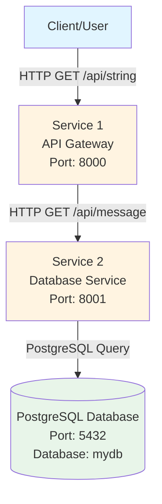

# Architecture

## System Overview



## Component Details

### Service 1 - API Gateway
- **Technology**: FastAPI (Python)
- **Port**: 8000
- **Endpoint**: `GET /api/string`
- **Function**: Receives client requests and forwards them to Service 2
- **Dependencies**: Service 2

### Service 2 - Database Service
- **Technology**: FastAPI (Python)
- **Port**: 8001
- **Endpoint**: `GET /api/message`
- **Function**: Queries PostgreSQL database and returns the stored string
- **Dependencies**: PostgreSQL

### PostgreSQL Database
- **Version**: 15 (Alpine)
- **Port**: 5432
- **Database**: mydb
- **Table**: messages
- **Data**: Seeded with sample strings

## Data Flow

1. **Client Request**: Client sends HTTP GET request to `http://localhost:8000/api/string`
2. **Service 1 Processing**: Service 1 receives the request and makes an HTTP call to Service 2
3. **Service 2 Processing**: Service 2 queries the PostgreSQL database
4. **Database Response**: PostgreSQL returns the stored message
5. **Response Chain**: Data flows back through Service 2 → Service 1 → Client

## Local Development (Docker Compose)

```
┌─────────────────────────────────────────────────────────────┐
│                    Docker Network                            │
│                                                              │
│  ┌──────────────┐      ┌──────────────┐      ┌──────────┐  │
│  │  Service 1   │──────│  Service 2   │──────│ Postgres │  │
│  │  :8000       │      │  :8001       │      │  :5432   │  │
│  └──────┬───────┘      └──────────────┘      └──────────┘  │
│         │                                                   │
└─────────┼───────────────────────────────────────────────────┘
          │
          │ Port Mapping
          │
    ┌─────▼─────┐
    │ localhost │
    │  :8000    │
    └───────────┘
```

### Container Configuration

| Container | Image | Environment | Port |
|-----------|-------|-------------|------|
| Service 1 | `service1/Dockerfile` | `DOWNSTREAM_URL` | 8000 |
| Service 2 | `service2/Dockerfile` | `DB_HOST`, `DB_PORT`, `DB_NAME`, `DB_USER`, `DB_PASSWORD` | 8001 |
| PostgreSQL | `postgres:15-alpine` | `POSTGRES_USER`, `POSTGRES_PASSWORD`, `POSTGRES_DB` | 5432 |

## Request/Response Flow

```
┌────────┐
│ Client │
└───┬────┘
    │ 1. GET /api/string
    ▼
┌─────────────┐
│ Service 1   │
│ (API)       │
└───┬─────────┘
    │ 2. GET /api/message
    ▼
┌─────────────┐
│ Service 2   │
│ (Database)  │
└───┬─────────┘
    │ 3. SELECT content FROM messages
    ▼
┌─────────────┐
│ PostgreSQL  │
│ Database    │
└───┬─────────┘
    │ 4. Return: "Hello from PostgreSQL!..."
    │
    │ 5. Response: {"message": "Hello from PostgreSQL!..."}
    │
    │ 6. Response: {"result": "Hello from PostgreSQL!..."}
    │
    ▼
┌────────┐
│ Client │
└────────┘
```

---

## Production Architecture (Kubernetes)

```
┌─────────────────────────────────────────────────────────────┐
│                        Client Layer                          │
└───────────────────────────┬─────────────────────────────────┘
                            │ HTTP/HTTPS
                            ▼
┌─────────────────────────────────────────────────────────────┐
│              Application Load Balancer (ALB)                 │
└───────────────────────────┬─────────────────────────────────┘
                            │ HTTP
                            ▼
┌─────────────────────────────────────────────────────────────┐
│                    Kubernetes Cluster                        │
│  ┌──────────────────────────────────────────────────────┐   │
│  │  Ingress (service1-ingress)                          │   │
│  └───────────────────┬──────────────────────────────────┘   │
│                      │                                       │
│  ┌───────────────────▼──────────────────────────────────┐   │
│  │  Service 1 (API Gateway) - Deployment                │   │
│  │  - FastAPI Application                                │   │
│  │  - Port: 8000                                         │   │
│  │  - Endpoint: GET /api/string                          │   │
│  └───────────────────┬──────────────────────────────────┘   │
│                      │ HTTP (Service DNS)                    │
│  ┌───────────────────▼──────────────────────────────────┐   │
│  │  Service 2 (Database Service) - Deployment            │   │
│  │  - FastAPI Application                                │   │
│  │  - Port: 8001                                         │   │
│  │  - Endpoint: GET /api/message                         │   │
│  └───────────────────┬──────────────────────────────────┘   │
└──────────────────────┼──────────────────────────────────────┘
                       │ PostgreSQL Protocol
                       ▼
┌─────────────────────────────────────────────────────────────┐
│                    RDS PostgreSQL Database                   │
│  - Database: mydb                                            │
│  - Table: messages                                           │
│  - Port: 5432                                                │
│  - Deployed in Private Subnets                               │
└─────────────────────────────────────────────────────────────┘
```

### Infrastructure Components

- **Kubernetes Cluster**: Managed control plane
- **Node Group**: Worker nodes running containers
- **Deployments**: Manages pod replicas for both services
- **Services**: Provides service discovery and load balancing
- **Ingress**: Routes external traffic to services (creates ALB)
- **RDS PostgreSQL**: Managed database in private subnets
- **VPC**: Network isolation with public and private subnets
- **Security Groups**: Network-level firewall rules